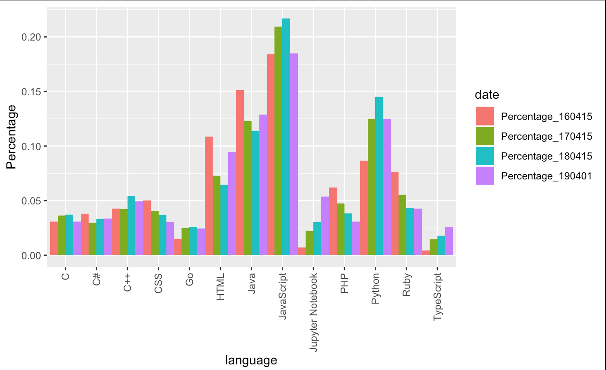
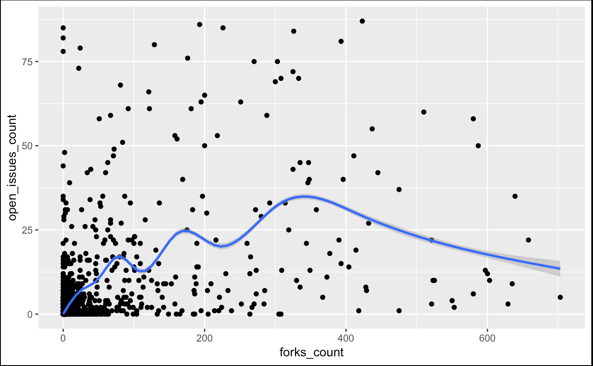
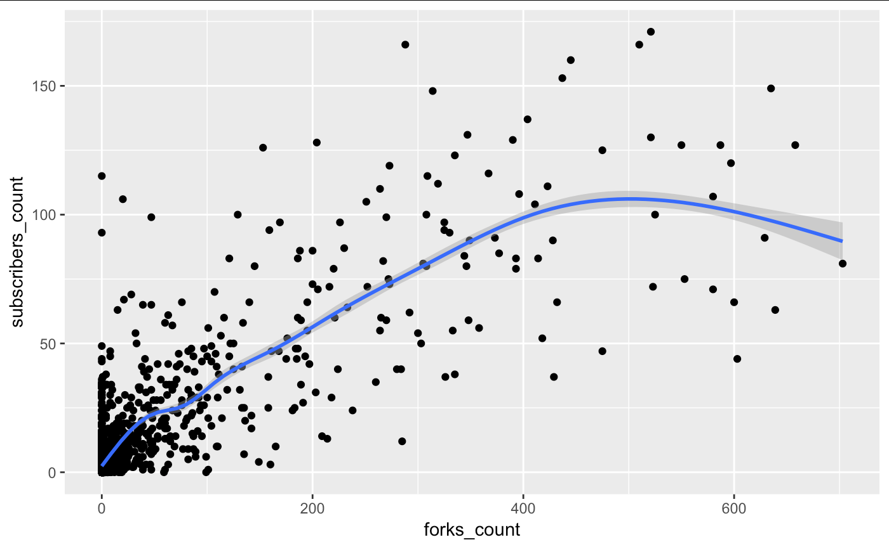
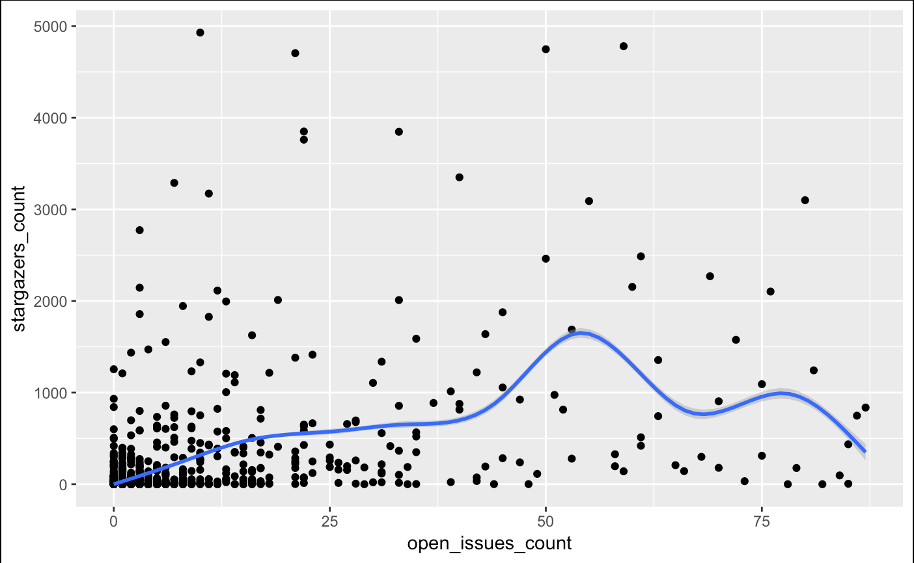
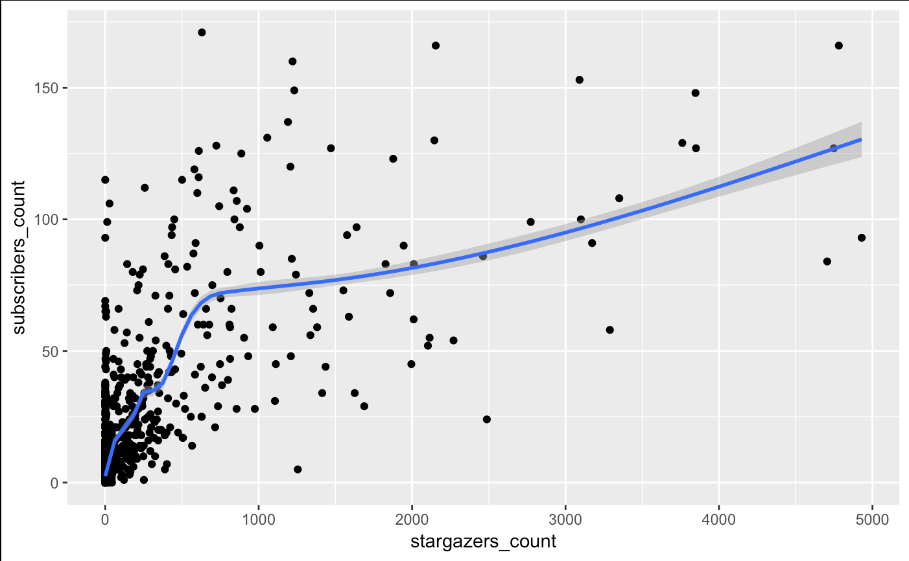

## Repository Analysis

When we were starting this part, one of our machine was running code that collects data. Because we have not got enough data to run our analysis, we used data downloaded from GHtorrent.

### Languages

We analyzed trends on popular languages, and here is insight on what we had found.

This is a word cloud of languages weighted by the number of repositories that use it in 2016 on the left and in 2019 on the right.

Below is a bar chart on language trends.

Here we can see that JavaScript has taken the mainstream for years and is likely to keep its position. Following are Python, Java, and HTML, keeping their high rank for years.

There is one rising language that is to be noticed, Jupyter Notebook. During this 4 years, more and more people start using Jupyter Notebook to be the main language of their repositories. In the bar chart, we can see that Jupyter Notebook has a very clear positive slop.

Another rising language is TypeScript, thought it does not have a dramatic slop like Jupyter Notebook, rise of usage of TypeScript is still significant.

On the other hand, the usage of PHP and CSS are going down in these years. Ruby is also not getting a very good time.

### Correlation within properties of a repository

Through GitHub API, we can get more informations about a repository, not only the main language it is using. Among them, `stargazers_count`, `forks_count`, `open_issues_count`, and `subscribers_count` are the ones that is quantifiable and is easy to be analyzed. Other properties are mostly links back to GitHub API, and those data are not easily available since it will cause more to fetch them and our computer may not have the ability to handle that much data.

We analyzed the correlation between these properties of a repo, and here is what we have found.

As we can see from the charts above, there might not be a very clear correlation between properties of a repo. Although it is noticed that `subscribers_count` is likely to have a linear relation with `forks_count`, and `subscribers_count` is likely to have a linear relation with `stargazers_count` with a non-differentiable singular point, in one sentence the correlation between repo properties is not clear.

## Prediction on popularity and other properties

We were attempting to make an artificial representative of popularity of a repo, and try to predict that popularity by properties of the owner of that repo.

First thing to do is to find that representative of popularity. After a few attempting, we decide to use the mean of normalized `stargazers_count`, `forks_count`, `open_issues_count`, and `subscribers_count` as our representative.

Next thing is what should our prediction be based on. We found that among properties of a user, the number of `public_repos`, `public_gists`, `followers`, and `followings` are quantifiable properties and are good for analysis. Other properties that are either true/false, such as if this user is a `student`, or a `professor`, or a `engineer`, or work in a `university`, are also considered in a new model, distinct with the model that only contains quantifiable properties.

We built a linear regression model and a binomial regression model on all quantifiable properties. Because it is a continuous variable, and we did not have a large training set, our prediction was pretty poor. The ratio that our prediction was ***100%*** away from the actual value was around ***85%***, and the ratio ***50%*** away from the actual value was only around ***16%***.

The reason why our prediction was this low, we think, is due to the representative of popularity that we were predicting was a continuous variable. Moreover, our representative of popularity might not be representing so much, either. Our idea of predicting popularity of a repo according to properties of the owner of that repo might simply be wrong from the beginning.

Since our prediction on popularity of a repo did not get a good result, we turned our attention on predicting properties of a user, more specifically, those binary properties of a user that is either true or false, such as if this user is a student or professor or engineer, etc.

Just like what we have done with repo properties, we built a linear regression model on quantifiable properties, i.e. `public_repos`, `public_gists`, `followers`, and `followings`. We then made a prediction on properties representing if this user is a student or professor or engineer or work in university. We also have made a binomial regression model and on more properties, not only quantifiable ones, and made a new prediction. The result was similar to linear regression model and to models with fewer inputs.

Our linear regression model that predicts if a user is a student was about ***93%*** accurate, and our binomial regression model gave a similar result.
Our linear regression model that predicts if a user is a professor was about ***84%*** accurate, and our binomial regression model gave a similar result.
Our linear regression model that predicts if a user is an engineer was about ***87%*** accurate, and our binomial regression model gave a similar result.
Our linear regression model that predicts if a user works in a university was about ***75%*** accurate, and our binomial regression model gave a similar result.

Result of regression above was acceptable.

We have also made a k-nn machine learning model to predict same properties like what we have done above with regression models.

After normalized all variables, we fit them into k-nn algorithm in `class` package. Our accuracy predicting if a user is a student was about ***87%*** accurate. Our accuracy predicting if a user is a professor was about ***76%*** accurate. Our accuracy predicting if a user is a student was about ***84%*** accurate. Our accuracy predicting if a user is a student was about ***64%*** accurate.

Result of k-nn algorithm above was also acceptable.
