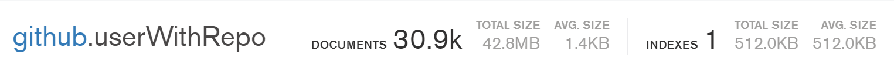
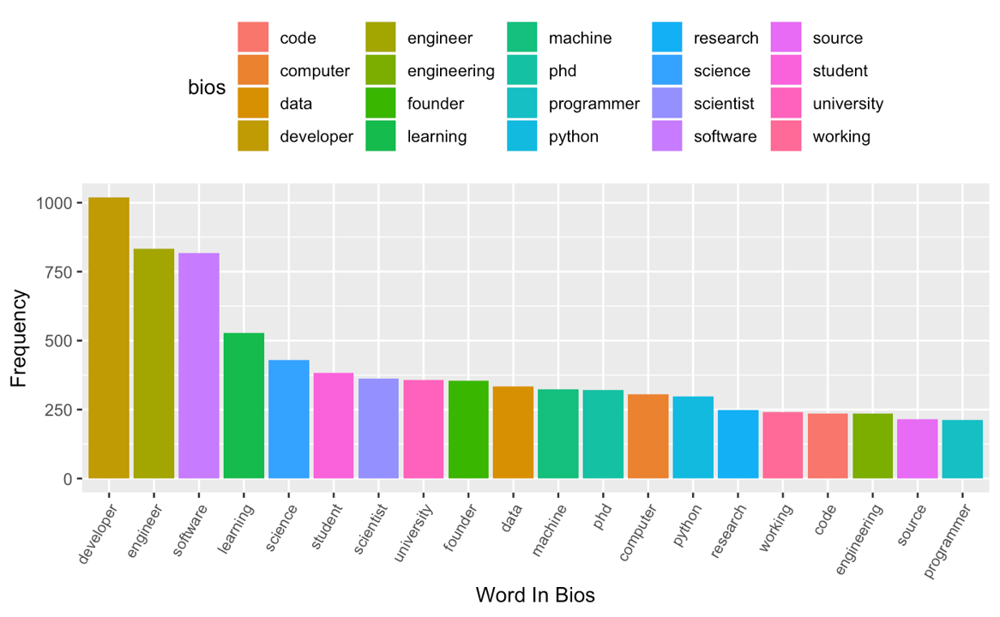
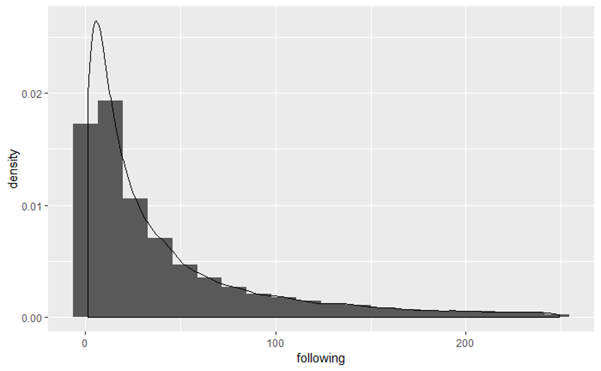
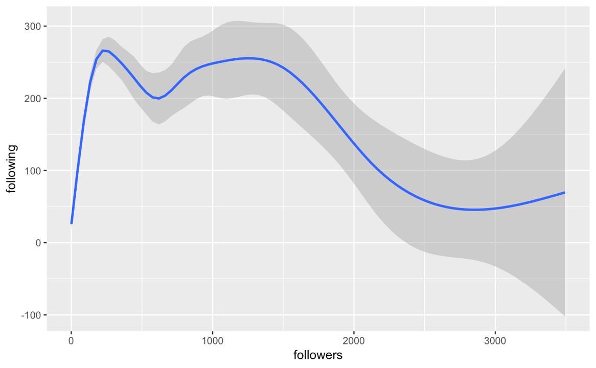

## Data Collection

###  Data through GitHub API
In this part, we make use of GitHub API to fetch users along with repositories information and store them in a mongoDB.

We view the entire community as a social network. As a result, we can represent this community using a graph. We try to use a breath first search to go through this graph. However, compared to the hourly limitation of accessing the API (**5000** per hour), there are simply too many of the users out in the wild. We managed to download about **30.9** thousand users information to our data base for about 10 hours. After fetching users information, we tried to explore their repositories. We go through the entire list of users and download their repositories to our data base. Finally we managed to fetch about **611.1** thousand repositories.

### Data through GHTorrent

GHTorrent is a project that stores all the activities on GitHub on a daily basis, including commits, commit comments, user information change, issues, etc. We can download activities of a given day from its download center in the form of MongoDB dumps (bson files). We made used of data on 04/01/2019, 04/15/2018, 04/15/2017, 04/15/2016.

GHTorrent Official Website: https://github.com/ghtorrent/ghtorrent.org

## User Analysis

Making use of the 30 thousand user's information, we figure out the users' geometric distribution, high-frequency words in self-introduction and company distribution. We also take a look into the relationship between number of followings and followers. Furthermore, effort is made on identifying who the users are through scanning key words in self-introduction. We tried to detect whether they are `student`, `researcher`, `engineer` or in `university`

### Data cleaning

Before the actual analysis, we download data from MongoDB and omit all the NAs. We decide to simply omit people with NAs because most of the entries does not contain NA and eliminating NA won't affect the population much.

We also deal with the outliers when analysing followers and followings. We discovered that some of the users follows more than 5000 people and have zero or very low followers. It is highly possible that they are bots. So we cleaned up them. We drop entries whose following is greater than 3 times the standard deviation plus mean.

### Where to find GitHub users

We find out people with an location. Then, collect those locations. Some of the users enter different locations seperated by comma, so we also split those phrases. Then, we drew a `wordcloud` and a `bar chart` based on those data.

We can see that San Francisco ranked first in all the cities, followed by Beijing and London. California has a high frequency of apperance in location discriptions. This result is making sense as regions ranked high in the list are traditionally considered as place where high tech company gathers.

We faced difficulties in location analysis. Since GitHub poses no restriction on location input, a large proportion of the locations are not in a cleaned form. For example, San Francisco, which ranked first in GitHub user's settlements, may be reffered to as San Fran, San Francisco Bay and San Francisco Bay area. We didn't figured out a way to convert those different versions. Users may also enter dumy values such as _127.0.0.1_, _localhost_, or _home_ and we have to ignore them. Additionaly, city names in other language are not translated to English in our analysis. For example, Hong Kong may be refered as _香港_ ; Tokyo may be refered as _東京_ , _東京都_ or _とうきょう_. Furthermore, there might be a bias in out data since we start to fetch users from our followers and following. We are Chinese speaking user so our following has a higher proportion of Chinese users than an average US user.

### Who are GitHub users

We extract all the words in the field `bio`, which is a self-introduction of a user, and find out frequently appeard contents. Those high frequency words concludes the overall identity of the GitHub community.

We find that there are a large number of _developer_ and _engineer_ tags within the community. This is the evidence to support that GitHub is the largest the community of developers. We can see _student_ , _professor_ and _scientist_ from education or research institutes as well. Interestingly, we see _Phd_ in our word list. Though the difficulty to develope a software is decreasing these years, developers might still hold a high level of degree.

We tried to detect whether users fall in the four collections: `student`, `researcher`, `engineer` or in `university` by scanning their self-introduction. This step is used for knn prediction in the following part.

In this part, the greatest difficulty is that we managed to extract a single word from the self-introduction. However, we break some of the word pairs, such like _software develope_. _machine learning_, _Neuro-linguistic programming_ and _natural language processing_. We didn't find a way to keep those phrases since we split all the words by spaces.

### What do GitHub users working for

We analyze the company field in the data and try to figure out what organizations hire these users.

### Followers and following

We are trying to find a relationship between number of followers and following in this section. We first deals with outliers to clean bots which I have mentioned in the data cleaning part.

We find that most of the user have a relatively low following and followers. **93%** of the users follow less than **250** users and **80%** follow less than **100**. We also find that the correlation between followings and followers are not very strong. When we are looking at an average user (followers and followings less than **100**), the coorelation is **0.287**. When we are looking at star users (followers greater than **100**), there is even a negative coorelation. From the graph above we can see that, there is a positive relation between followers and followings when the number of followers is small. This simulates a user starting to involve in this community. However, when follower grows, the curve is flat. There is a limitation on the size of social network and a user simply does not have enough efforts to know a lot people. When a user become a "star" in the community, he follows less user. I haven't firgured out why. Probably it's time to stay cool and focus on his or her own codes. For example, Linus Torvalds, the developer of linux kernel, follows no one and has over 90000 followers.

### Relating repositories and users

We fetched repositories and users in parellel and didn't created a relation between them. The last part of the code in `User_Analysis.rmd` tries to relate them. That block of code generates a csv file of all repositories along with their owners information. This file is used in prediction.
