# GitHub User Analysis

Member: Xin Guan | Ziqian Ge

GitHub is a web-based hosting service of version control using Git. It claims to be the world's largest community of developers and discovers. Up to October 2018, there are 31 million users and over 100 million repositories on GitHub. According to Evans Data Corporation(EDC) there are about 23 million developers worldwide. So we believe that Github is a good representation of United States even world developers. We would like to study the collection of developers through analyzing GitHub community.Our goal in this project is finding out who are these developers and popular trends among them.

## Data Collection

###  Data through GitHub API
In this part, we make use of GitHub API to fetch users along with repositories information and store them in a mongoDB.

We view the entire community as a social network. As a result, we can represent this community using a graph. We try to use a breath first search to go through this graph. However, compared to the hourly limitation of accessing the API (**5000** per hour), there are simply too many of the users out in the wild. We managed to download about **30.9** thousand users information to our data base for about 10 hours. After fetching users information, we tried to explore their repositories. We go through the entire list of users and download their repositories to our data base. Finally we managed to fetch about **611.1** thousand repositories.

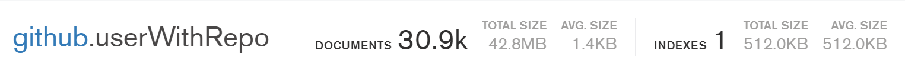

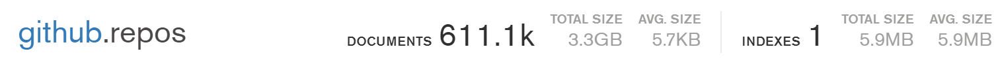

### Data through GHTorrent

GHTorrent is a project that stores all the activities on GitHub on a daily basis, including commits, commit comments, user information change, issues, etc. We can download activities of a given day from its download center in the form of MongoDB dumps (bson files). We made used of data on 04/01/2019, 04/15/2018, 04/15/2017, 04/15/2016.

GHTorrent Official Website: https://github.com/ghtorrent/ghtorrent.org

## User Analysis

Making use of the 30 thousand user's information, we figure out the users' geometric distribution, high-frequency words in self-introduction and company distribution. We also take a look into the relationship between number of followings and followers. Furthermore, effort is made on identifying who the users are through scanning key words in self-introduction. We tried to detect whether they are `student`, `researcher`, `engineer` or in `university`

### Data cleaning

Before the actual analysis, we download data from MongoDB and omit all the NAs. We decide to simply omit people with NAs because most of the entries does not contain NA and eliminating NA won't affect the population much.

We also deal with the outliers when analyzing followers and followings. We discovered that some of the users follows more than 5000 people and have zero or very low followers. It is highly possible that they are bots. So we cleaned up them. We drop entries whose following is greater than 3 times the standard deviation plus mean.

### Where to find GitHub users

We find out people with a valid location. Then, collect those locations. Some of the users enter different locations separated by comma, so we also split those phrases. Then, we drew a `wordcloud` and a `bar chart` based on those data.

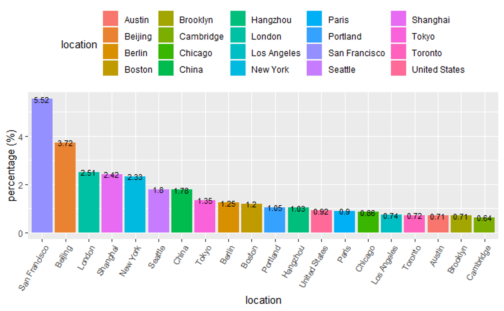

We can see that San Francisco ranked first in all the cities, followed by Beijing and London. California has a high frequency of appearance in location descriptions. This result is making sense as regions ranked high in the list are traditionally considered as place where high tech company gathers.

We faced difficulties in location analysis. Since GitHub poses no restriction on location input, a large proportion of the locations are not in a cleaned form. For example, San Francisco, which ranked first in GitHub user's settlements, may be referred to as San Fran, San Francisco Bay and San Francisco Bay area. We didn't figured out a way to convert those different versions. Users may also enter dummy values such as _127.0.0.1_, _localhost_, or _home_ and we have to ignore them. Additionally, city names in other language are not translated to English in our analysis. For example, Hong Kong may be referred as _香港_ ; Tokyo may be referred as _東京_ , _東京都_ or _とうきょう_. Furthermore, there might be a bias in out data since we start to fetch users from our followers and following. We are Chinese speaking user so our following has a higher proportion of Chinese users than an average US user.

### Who are GitHub users

We extract all the words in the field `bio`, which is a self-introduction of a user, and find out frequently appeared contents. Those high frequency words concludes the overall identity of the GitHub community.

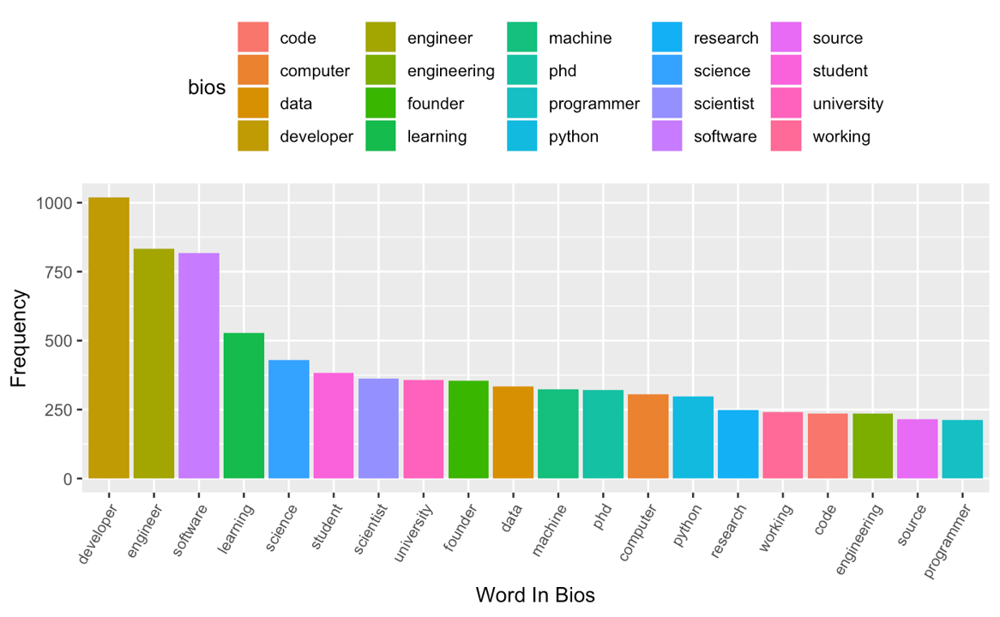

We find that there are a large number of _developer_ and _engineer_ tags within the community. This is the evidence to support that GitHub is the largest the community of developers. We can see _student_ , _professor_ and _scientist_ from education or research institutes as well. Interestingly, we see _Phd_ in our word list. Though the difficulty to develop a software is decreasing these years, developers might still hold a high level of degree.

We tried to detect whether users fall in the four collections: `student`, `researcher`, `engineer` or in `university` by scanning their self-introduction. This step is used for knn prediction in the following part.

In this part, the greatest difficulty is that we managed to extract a single word from the self-introduction. However, we break some of the word pairs, such like _software develop_. _machine learning_, _Neuro-linguistic programming_ and _natural language processing_. We didn't find a way to keep those phrases since we split all the words by spaces.

### What do GitHub users working for

We analyze the company field in the data and try to figure out what organizations hire these users.

### Followers and following

We are trying to find a relationship between number of followers and following in this section. We first deals with outliers to clean bots which I have mentioned in the data cleaning part.

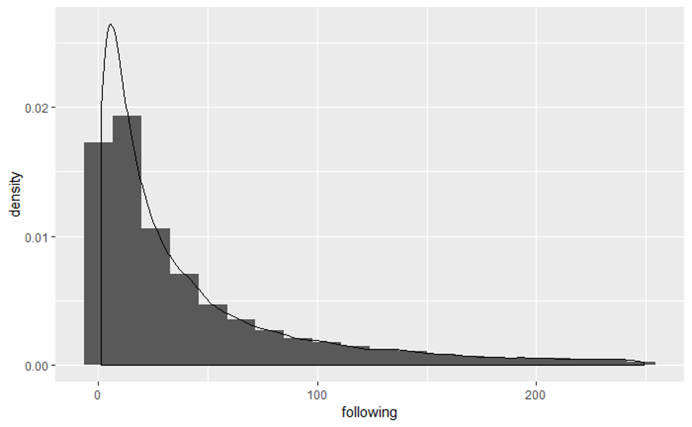

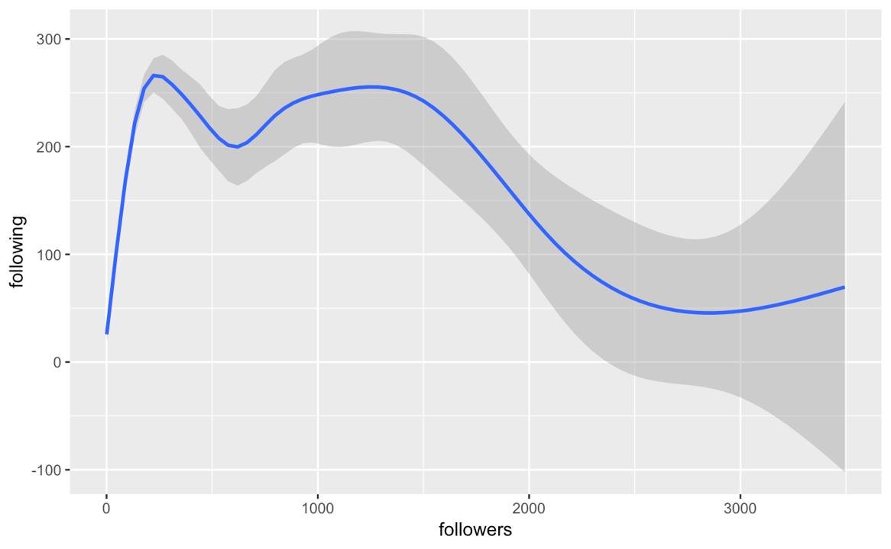

We find that most of the user have a relatively low following and followers. **93%** of the users follow less than **250** users and **80%** follow less than **100**. We also find that the correlation between followings and followers are not very strong. When we are looking at an average user (followers and followings less than **100**), the correlation is **0.287**. When we are looking at star users (followers greater than **100**), there is even a negative correlation. From the graph above we can see that, there is a positive relation between followers and followings when the number of followers is small. This simulates a user starting to involve in this community. However, when follower grows, the curve is flat. There is a limitation on the size of social network and a user simply does not have enough efforts to know a lot people. When a user become a "star" in the community, he follows less user. I haven't figured out why. Probably it's time to stay cool and focus on his or her own codes. For example, Linus Torvalds, the developer of linux kernel, follows no one and has over 90000 followers.

### Relating repositories and users

We fetched repositories and users in parallel and didn't created a relation between them. The last part of the code in `User_Analysis.rmd` tries to relate them. That block of code generates a csv file of all repositories along with their owners information. This file is used in prediction.

## Repository Analysis

When we were starting this part, one of our machine was running code that collects data. Because we have not got enough data to run our analysis, we used data downloaded from GHtorrent.

### Languages

We analyzed trends on popular languages, and here is insight on what we had found.

This is a word cloud of languages weighted by the number of repositories that use it in 2016 on the left and in 2019 on the right.

Below is a bar chart on language trends.

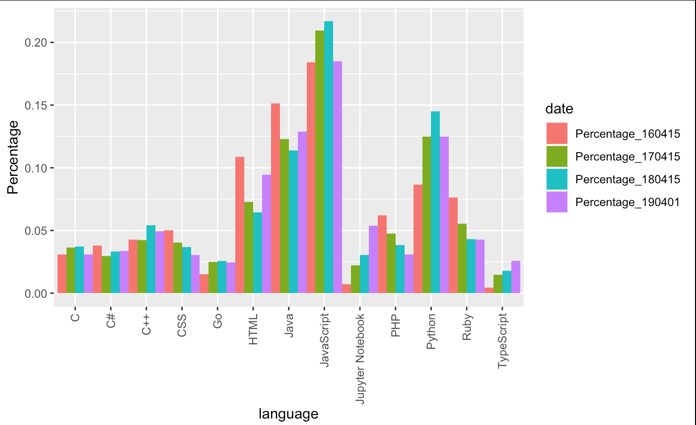

Here we can see that JavaScript has taken the mainstream for years and is likely to keep its position. Following are Python, Java, and HTML, keeping their high rank for years.

There is one rising language that is to be noticed, Jupyter Notebook. During this 4 years, more and more people start using Jupyter Notebook to be the main language of their repositories. In the bar chart, we can see that Jupyter Notebook has a very clear positive slop.

Another rising language is TypeScript, thought it does not have a dramatic slop like Jupyter Notebook, rise of usage of TypeScript is still significant.

On the other hand, the usage of PHP and CSS are going down in these years. Ruby is also not getting a very good time.

### Correlation within properties of a repository

Through GitHub API, we can get more informations about a repository, not only the main language it is using. Among them, `stargazers_count`, `forks_count`, `open_issues_count`, and `subscribers_count` are the ones that is quantifiable and is easy to be analyzed. Other properties are mostly links back to GitHub API, and those data are not easily available since it will cause more to fetch them and our computer may not have the ability to handle that much data.

We analyzed the correlation between these properties of a repo, and here is what we have found.

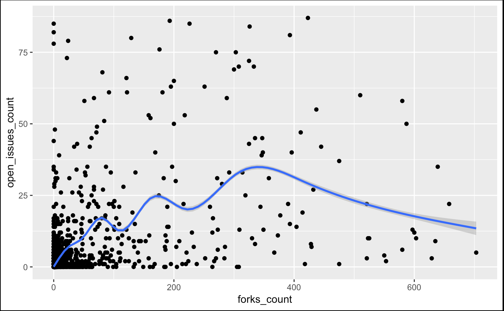
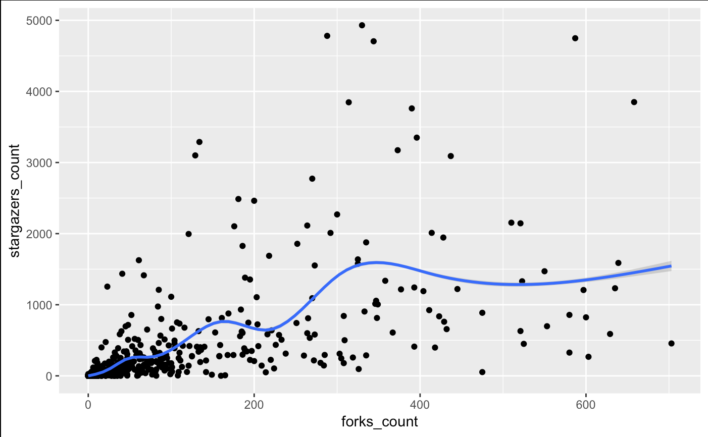
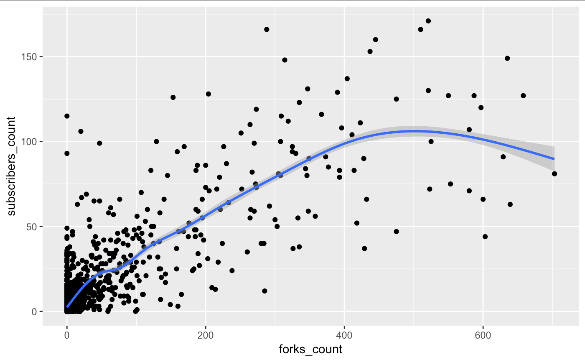
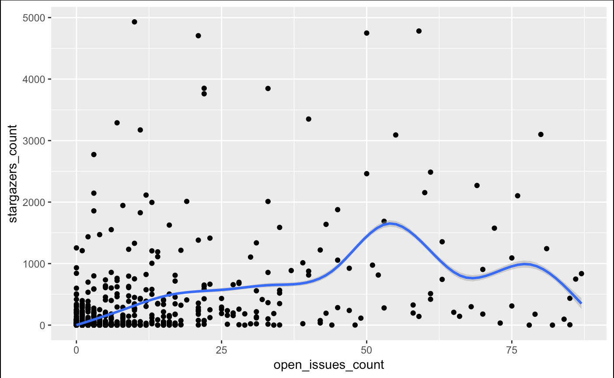
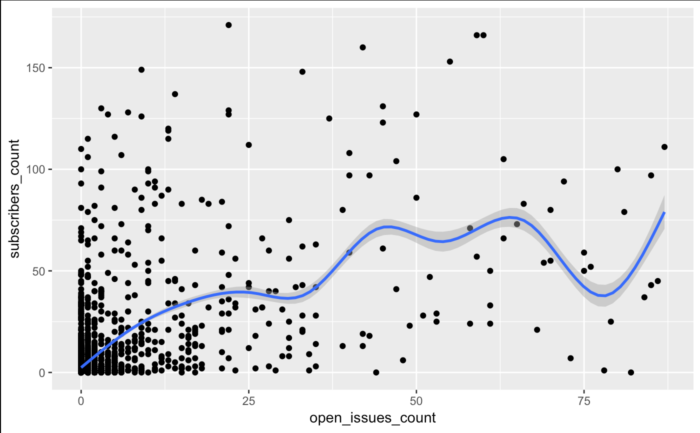
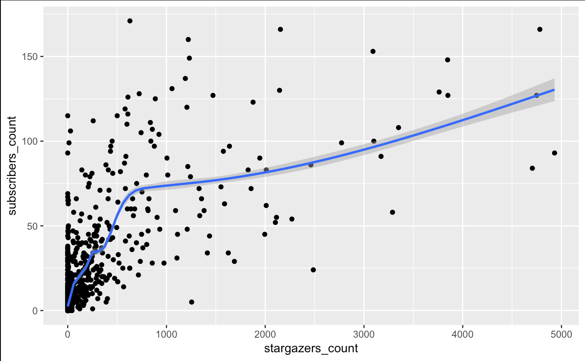

As we can see from the charts above, there might not be a very clear correlation between properties of a repo. Although it is noticed that `subscribers_count` is likely to have a linear relation with `forks_count`, and `subscribers_count` is likely to have a linear relation with `stargazers_count` with a non-differentiable singular point, in one sentence the correlation between repo properties is not clear.

## Prediction on popularity and other properties

We were attempting to make an artificial representative of popularity of a repo, and try to predict that popularity by properties of the owner of that repo.

First thing to do is to find that representative of popularity. After a few attempting, we decide to use the mean of normalized `stargazers_count`, `forks_count`, `open_issues_count`, and `subscribers_count` as our representative.

Next thing is what should our prediction be based on. We found that among properties of a user, the number of `public_repos`, `public_gists`, `followers`, and `followings` are quantifiable properties and are good for analysis. Other properties that are either true/false, such as if this user is a `student`, or a `professor`, or a `engineer`, or work in a `university`, are also considered in a new model, distinct with the model that only contains quantifiable properties.

We built a linear regression model and a binomial regression model on all quantifiable properties. Because it is a continuous variable, and we did not have a large training set, our prediction was pretty poor. The ratio that our prediction was ***100%*** away from the actual value was around ***85%***, and the ratio ***50%*** away from the actual value was only around ***16%***.

The reason why our prediction was this low, we think, is due to the representative of popularity that we were predicting was a continuous variable. Moreover, our representative of popularity might not be representing so much, either. Our idea of predicting popularity of a repo according to properties of the owner of that repo might simply be wrong from the beginning.

Since our prediction on popularity of a repo did not get a good result, we turned our attention on predicting properties of a user, more specifically, those binary properties of a user that is either true or false, such as if this user is a student or professor or engineer, etc.

Just like what we have done with repo properties, we built a linear regression model on quantifiable properties, i.e. `public_repos`, `public_gists`, `followers`, and `followings`. We then made a prediction on properties representing if this user is a student or professor or engineer or work in university. We also have made a binomial regression model and on more properties, not only quantifiable ones, and made a new prediction. The result was similar to linear regression model and to models with fewer inputs.

Our linear regression model that predicts if a user is a student was about ***93%*** accurate, and our binomial regression model gave a similar result. Our linear regression model that predicts if a user is a professor was about ***84%*** accurate, and our binomial regression model gave a similar result. Our linear regression model that predicts if a user is an engineer was about ***87%*** accurate, and our binomial regression model gave a similar result. Our linear regression model that predicts if a user works in a university was about ***75%*** accurate, and our binomial regression model gave a similar result.

Result of regression above was acceptable.

We have also made a k-nn machine learning model to predict same properties like what we have done above with regression models.

After normalized all variables, we fit them into k-nn algorithm in `class` package. Our accuracy predicting if a user is a student was about ***87%*** accurate. Our accuracy predicting if a user is a professor was about ***76%*** accurate. Our accuracy predicting if a user is a student was about ***84%*** accurate. Our accuracy predicting if a user is a student was about ***64%*** accurate.

Result of k-nn algorithm above was also acceptable.
