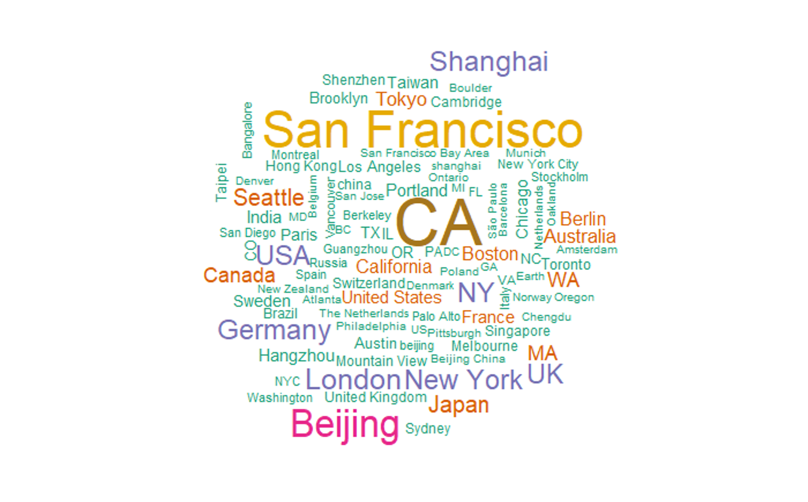
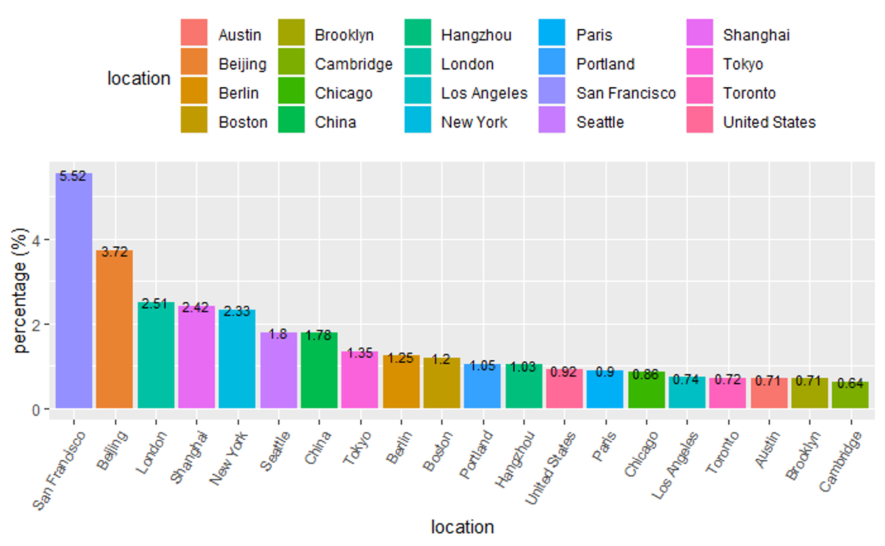

## Data Collection

###  Data through GitHub API
In this part, we made use of GitHub API to fetch users and repositories information and stored them in a mongoDB.

We view the entire community as a social network. As a result, we can represent this community using a graph. We try to use a breath first search to go through this graph. However, compared to the hourly limitation of accessing the API (5000 per hour), there are simply too many of the users out in the wild. We managed to download about **30.9** thousand users' information to our data base in about 10 hours. After fetching users' information, we tried to explore their repositories. We go through the entire list of users and download their repositories to our data base. Finally we managed to fetch about **611.1** thousand repositories.

### Data through GHTorrent

GHTorrent is a project that stores all the activities on GitHub every day, including commits, commit comments, user information change, issues, etc. We can download all the activities of a given day from its download center in the form of MongoDB dumps (bson files). We made used of data on 04/01/2019, 04/15/2018, 04/15/2017, 04/15/2016.

GHTorrent Official Website: https://github.com/ghtorrent/ghtorrent.org

## User Analysis

Making use of the 30 thousand user's information, we figure out the geometric distribution, high-frequency words in self-introduction, company distribution. We also take a look into the relationship between number of followings and followers. Furthermore, effort is made on identifying who the users are through scanning key words in self-introduction. We tried to detect whether they are `student`, `researcher`, `engineer` or in `university`

### Data cleaning

Before the actual analysis, we download data from MongoDB and omit all the NAs. We decided to simply omit people with NA because most of the entries does not contain NA and eliminating NA won't affect the population much.

### Where to find GitHub users

We find out people without an empty location. Then collect those locations. Some of the user entered different locations seperated by comma, so we also split those phrases. Then, we drew a `wordcloud` and bar chart based on those data.

We can see that San Francisco ranked first in all the cities, followed by Beijing and London. And California has a high frequency of apperance in location discriptions.

We also faced difficulties in location analysis. Since GitHub poses no restriction on location input, a large proportion of the locations are not in a cleaned form. For example, San Francisco, which ranked first in GitHub user's settlements, may be reffered to as San Fran, San Francisco Bay and San Francisco Bay area. We didn't figured out a way to convert those different versions. Additionaly, city name in other language are not translated to English in our analysis. For example, Hong Kong may be refered as 香港; Tokyo may be refered as 東京 or とうきょう.
